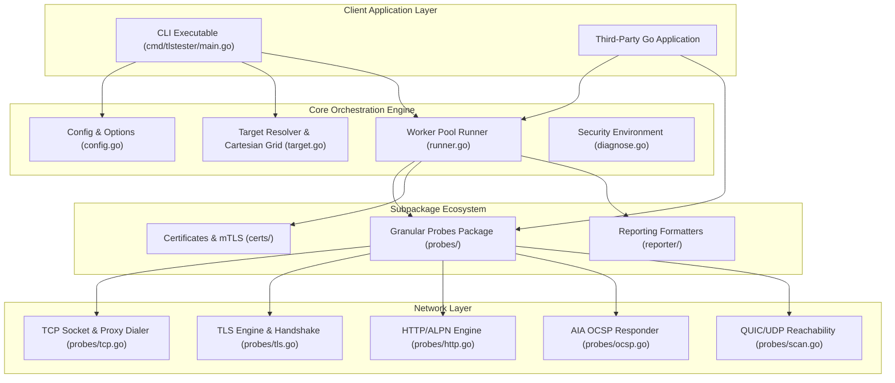
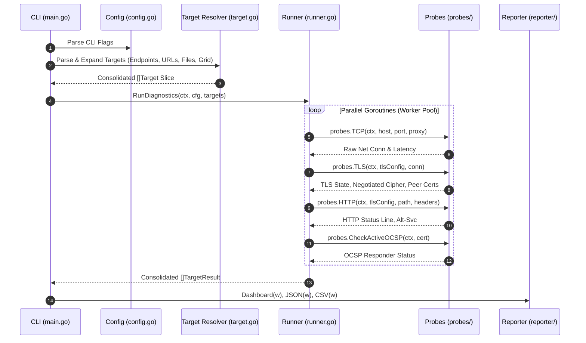
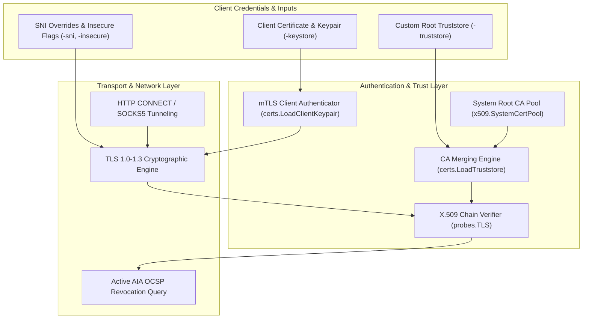

# TLS Connection Tester (Go tlstester) - System Architecture

This document details the system architecture, design choices, data flow pipelines, dependency models, performance engineering, integration models, and security controls for the **TLS Connection Tester** (`tlstester`).

---

## 1. Architecture and Design Choices

`tlstester` is built as a modular, decoupled Go library and command-line utility designed for high-concurrency network probing with zero external dependencies.



### 1.1 Architectural Choices
- **Dual Consumption Model**: Decoupled into `package tlstester` (root orchestration), `package probes` (raw network calls), `package certs` (cryptographic cert loading), `package reporter` (output formatting), and `cmd/tlstester` (CLI wrapper).
- **Zero External Dependencies**: Implemented strictly using Go standard library packages (`crypto/tls`, `net/http`, `net`, `x509`).
- **Context-Aware Asynchronous Execution**: All network operations propagate `context.Context` deadlines for timeouts, cancellations, and signal trapping.
- **Side-Effect Free Pipeline**: Formatters write to `io.Writer` targets without mutating process-global state or `os.Stdout`.

### 1.2 Assumptions
- **Host Reachability**: Probes assume network layer IP reachability or valid HTTP/SOCKS proxy configurations.
- **Root Truststore Pool**: Uses the host operating system's root certificate pool by default (`x509.SystemCertPool()`), dynamically appending custom truststores.
- **Port Defaults**: Targets specified without ports default to HTTPS port `443` (or HTTP port `80` for HTTP URLs).

### 1.3 Edge Cases & Defensive Handling
- **Untrusted Self-Signed Certificates**: When TLS handshakes fail due to trust validation errors, `probes.TLS` executes an insecure fallback probe to capture peer certificates for inspection.
- **SNI Mismatch**: When `-sni` or host headers conflict with target hostnames, TLS verification errors are reported explicitly without crashing.
- **HTTP/2 Transport Fallback**: Custom `tls.Config` supplied to `http.Transport` explicitly enables `ForceAttemptHTTP2: true` to prevent Go's standard library from silently downgrading to HTTP/1.1.
- **Proxy Failures**: Connection dropouts or proxy status rejections (e.g. HTTP 403 or SOCKS5 auth failure) emit granular diagnostic error messages.

### 1.4 Performance & Efficiency
- **Goroutine Worker Pool**: Parallelizes diagnostics across targets using a fixed-size worker pool (`cfg.Workers`), eliminating process spawning overhead.
- **Buffer Recycling & Zero Memory Leaks**: Uses `defer socket.Close()` and `defer resp.Body.Close()` to flush buffers and prevent file descriptor exhaustion.
- **Sub-Second Execution**: Local mock test suite executes in **< 0.8s**, enabling rapid CI integration.

---

## 2. Integration & Module Package Tree

`tlstester` is designed to be easily integrated into third-party Go services, web backends, Kubernetes controllers, and CI/CD tools.

### 2.1 Module & Package Hierarchy Tree

```text
github.com/edsilegxrepo/tlstester (Go Module Root)
│
├── config.go             # Root API: Config struct, NewConfig(), StringSliceFlag
├── target.go             # Root API: Target, TargetResult, ParseTargets(), ParseURLTarget()
├── runner.go             # Root API: RunDiagnostics(), ExecuteTarget(), CreateTLSConfig()
├── diagnose.go           # Root API: GetSecurityEnvironment(), DumpDiagnostics()
│
├── probes/               # Subpackage: Low-Level Granular Probes (package probes)
│   ├── tcp.go            # probes.TCP(), probes.DialViaProxy()
│   ├── tls.go            # probes.TLS(), probes.TLSOptions, probes.TLSResult, probes.SCTInfo, probes.ExportCertificates()
│   ├── http.go           # probes.HTTP()
│   ├── scan.go           # probes.ScanCipherSuites(), probes.TestSessionResumption(), probes.CheckQUIC()
│   └── ocsp.go           # probes.CheckOCSPRevocation(), probes.FetchIssuerFromAIA(), probes.CheckActiveOCSP()
│
├── certs/                # Subpackage: Cryptographic Certificates & mTLS (package certs)
│   └── certs.go          # certs.LoadTruststore(), certs.LoadClientKeypair(), certs.DaysUntilExpiration()
│
├── reporter/             # Subpackage: Output Formatters & Reporters (package reporter)
│   └── reporter.go       # reporter.Dashboard(), reporter.JSON(), reporter.CSV()
│
└── cmd/tlstester/        # Subpackage: Executable CLI Entrypoint (package main)
    └── main.go           # CLI flag parsing, signal context wiring, log file redirection
```

### 2.2 How to Consume the Library in Third-Party Go Applications

To consume `tlstester` programmatically, add the module import to your Go project:
```bash
go get github.com/edsilegxrepo/tlstester
```

#### Pattern A: High-Level Batch Diagnostic Orchestration (`package tlstester`)
Use the root package when you want to execute concurrent diagnostics across multiple targets with automated worker pools and structured output formatters:

```go
package main

import (
	"context"
	"fmt"
	"os"
	"time"

	"github.com/edsilegxrepo/tlstester"
	"github.com/edsilegxrepo/tlstester/reporter"
)

func main() {
	ctx, cancel := context.WithTimeout(context.Background(), 15*time.Second)
	defer cancel()

	// 1. Initialize Configuration
	cfg := tlstester.NewConfig()
	cfg.Workers = 8
	cfg.Timeout = 5 * time.Second
	cfg.Cert = true
	cfg.CheckOCSP = true

	// 2. Parse Multi-Source Targets
	targets, err := tlstester.ParseTargets(cfg, "api.github.com:443", "google.com:443", "https://cloudflare.com")
	if err != nil {
		panic(err)
	}

	// 3. Execute Worker Pool Probes
	results := tlstester.RunDiagnostics(ctx, cfg, targets)

	// 4. Export Formatted Results to stdout or custom Writer
	_ = reporter.JSON(os.Stdout, results)
}
```

#### Pattern B: Low-Level Granular Network Probing (`package probes`)
Use `package probes` directly when building custom networking agents or microservices that need raw TCP socket, TLS handshake, or HTTP probing capabilities without invoking the batch orchestration engine:

```go
package main

import (
	"context"
	"fmt"
	"time"

	"github.com/edsilegxrepo/tlstester"
	"github.com/edsilegxrepo/tlstester/probes"
)

func main() {
	ctx, cancel := context.WithTimeout(context.Background(), 5*time.Second)
	defer cancel()

	// 1. Raw TCP Socket & Proxy Probe
	conn, ips, dnsLatency, tcpLatency, err := probes.TCP(ctx, "google.com", 443, 5*time.Second, 2, "", "")
	if err != nil {
		panic(err)
	}
	defer conn.Close()

	fmt.Printf("Resolved IPs: %v | DNS: %v | TCP: %v\n", ips, dnsLatency, tcpLatency)

	// 2. Granular TLS Handshake Probe (using TLSOptions struct)
	tlsConfig, _ := tlstester.CreateTLSConfig(tlstester.NewConfig(), tlstester.Target{Host: "google.com", Port: 443})
	tlsConn, tlsRes, err := probes.TLS(ctx, probes.TLSOptions{
		Config:  tlsConfig,
		Host:    "google.com",
		Port:    443,
		RawConn: conn,
		Timeout: 5 * time.Second,
		Retries: 2,
	})
	if err != nil {
		panic(err)
	}
	defer tlsConn.Close()

	fmt.Printf("TLS Protocol: %s | Cipher: %s | Handshake Latency: %v | SCTs: %d\n",
		tlsRes.Protocol, tlsRes.Cipher, tlsRes.HandshakeLatency, tlsRes.SCTCount)
}
```

#### Pattern C: Cryptographic Certificate Management (`package certs`)
Use `package certs` to load custom PEM root certificate truststores or client mTLS certificate keypairs:

```go
package main

import (
	"fmt"
	"github.com/edsilegxrepo/tlstester/certs"
)

func main() {
	// Load custom PEM truststore appended to system roots
	rootPool, err := certs.LoadTruststore("/etc/ssl/certs/internal-ca.pem")
	if err != nil {
		panic(err)
	}
	_ = rootPool

	// Load client certificate keypair for mTLS authentication
	keypairs, err := certs.LoadClientKeypair("/etc/ssl/certs/client-identity.pem")
	if err == nil {
		fmt.Printf("Loaded %d mTLS client certificates\n", len(keypairs))
	}
}
```

---

## 3. Data Flow and Control Logic

### 3.1 Operational Flow & Code Relations


### 3.2 Data Pipeline & Data Structures
1. `Config`: Holds user options (timeouts, retries, worker count, TLS flags, proxy settings, export formats).
2. `Target`: Represents a single host, port, and HTTP path tuple.
3. `TargetResult`: Contains DNS latency, TCP latency, TLS latency, HTTP TTFB, negotiated TLS version, cipher suite, ALPN, key exchange curve, OCSP status, captured certificate chain, and assertion error strings.

---

## 4. Dependencies

`tlstester` enforces a **strict zero external dependency constraint**. It builds directly with standard Go compilers on Windows, Linux, and macOS.

### Standard Library Package Matrix
| Package | Architectural Purpose |
| :--- | :--- |
| `crypto/tls` | TLS 1.0–1.3 handshakes, cipher suite definitions, ALPN, session ticket cache. |
| `crypto/x509` | X.509 certificate parsing, truststore pool management, PEM encoding. |
| `golang.org/x/crypto/ocsp` | OCSP request/response creation and parsing per RFC 6960. |
| `net` | Raw TCP socket dialing, DNS host lookups, UDP/QUIC reachability probes. |
| `net/http` | Application-layer HTTP GET probing, custom header injection, `Alt-Svc` parsing. |
| `net/http/httptest` | In-memory TLS/HTTP test servers for sub-second mock unit tests. |
| `encoding/json` | Serialized JSON array output formatters. |
| `encoding/csv` | Tabular CSV summary report generation. |
| `os/signal` | Graceful SIGINT/SIGTERM OS signal context cancellation. |

---

## 5. Security Architecture



### 5.1 Authentication & Trust Layers
- **System CA Integration**: Inherits the operating system's native certificate trust pool (`x509.SystemCertPool()`), merging user-supplied root certificates (`-truststore`) dynamically without discarding default public CAs.
- **Mutual TLS (mTLS) Authentication**: Supports client certificate and private key pair loading (`-keystore`) for authenticating against protected internal enterprise endpoints.
- **Server Identity Verification**: Verifies X.509 certificate chains, expiration windows, and SAN/CN hostname matches.

### 5.2 Security Controls & Access Scoping
- **Insecure Bypass Controls**: Skip chain of trust verification (`-insecure`) for testing self-signed certificates in non-production environments.
- **SNI Control**: Enforces Server Name Indication header generation based on target hostnames, with options to override (`-sni`) or disable (`-no-sni`).
- **Active Revocation Auditing**: Queries certificate Authority Information Access (AIA) OCSP responder endpoints dynamically to detect revoked certificates.
- **Least-Privilege Network Access**: Operates entirely in user-space without requiring root/administrator privileges.

---

## 6. Related Documentation

- [README.md](README.md): User guide, flags reference, CLI examples, build instructions.
- [DESIGN.md](DESIGN.md): Detailed specifications, sequence diagrams, design choices.
- [TESTING.md](TESTING.md): Test suite architecture, code coverage reports, live CDN tests.
