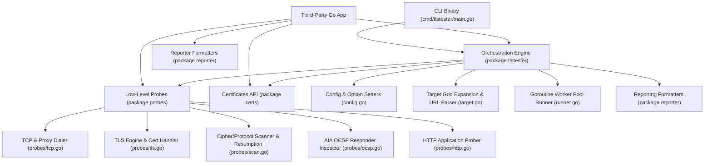
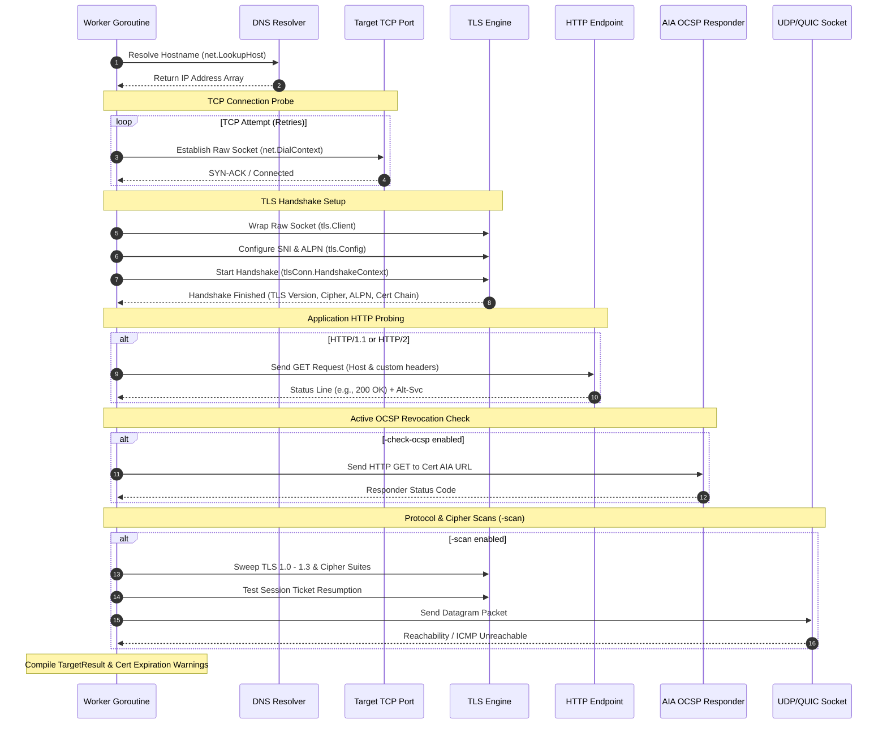

# TLS Connection Tester (Go tlstester) - Design Document

## 1. Application Overview and Objectives

The **TLS Connection Tester** (`tlstester`) is a production-grade, single-binary TLS diagnostics utility and importable library written in Go. It is designed to probe network targets, verify cryptographic safety, audit certificate chains, test session resumption, inspect negotiated ciphers, evaluate HTTP/ALPN endpoints, and route outbound diagnostic traffic through HTTP or SOCKS proxies.

`tlstester` is engineered to be consumed **BOTH as a standalone CLI executable** (`cmd/tlstester`) and **integrated programmatically as importable Go library packages** (`criticalsys.net/tlstester`, `criticalsys.net/tlstester/probes`, `criticalsys.net/tlstester/certs`, `criticalsys.net/tlstester/reporter`). For system architecture details, refer to [ARCHITECTURE.md](ARCHITECTURE.md).

### Key Functional Objectives
* **Parallelized Target Probing**: Scale diagnostics across multiple targets concurrently using configurable Goroutine worker pools (`-workers`).
* **Cartesian Probing Grid**: Support automated target grid expansion across combinations of hostnames and ports (`-hostname` and `-port`).
* **Cryptographic Auditing**: Enforce deep security validation of TLS protocols and cipher suites (`-scan`), scanning for obsolete protocols (TLS 1.0, TLS 1.1) and weak ciphers.
* **Certificate Chain Validation**: Inspect certificate validity windows, CN/SAN matches, validation chains, serial numbers, and signature algorithms, capturing peer certificates even when handshakes fail.
* **Dual-Layer Diagnostics**: Prove socket layer reachability (including SOCKS/HTTP proxy routing and UDP/QUIC reachability) as well as application-layer health via HTTP GET status assertions, ALPN verification, and `Alt-Svc` header extraction.
* **Active Revocation & Expiration Alerts**: Perform active AIA OCSP responder checks (`-check-ocsp`) and enforce certificate expiration warning thresholds (`-warn-days`).
* **Structured Pipeline Output**: Supply tabular ANSI reports for humans, CSV exports (`-csv`), log file redirection (`-log`), and comprehensive JSON outputs (`-json`) for integration into automated CI/CD and deployment pipelines.
* **Zero External Dependencies**: Direct compilation against Go's standard library (`crypto/tls`, `net/http`, `net`, `x509`).

---

## 2. Architecture and Design Choices

### 2.1 Modular Component Layout
- [cmd/tlstester/main.go](cmd/tlstester/main.go): Pure CLI entry point. Handles flag parsing, OS signal trapping (`signal.NotifyContext`), file log redirection, and process exit code resolution.
- [probes/tcp.go](probes/tcp.go): Granular, context-aware TCP socket dialing, retries, DNS/TCP latency measurement, and HTTP/SOCKS5 proxy tunneling (`probes.TCP`, `probes.DialViaProxy`).
- [probes/tls.go](probes/tls.go): Granular, context-aware TLS handshake execution, SNI controls, peer certificate extraction on failure, and PEM cert exporter (`probes.TLS`, `probes.ExportCertificates`).
- [probes/ocsp.go](probes/ocsp.go): Active AIA OCSP responder prober (`probes.CheckActiveOCSP`).
- [probes/http.go](probes/http.go): HTTP GET probing over TLS, custom header injection, `Alt-Svc` extraction, and status assertions (`probes.HTTP`).
- [probes/scan.go](probes/scan.go): Cipher suite scanner (`probes.ScanCipherSuites`), session resumption tester (`probes.TestSessionResumption`), and UDP/QUIC reachability check (`probes.CheckQUIC`).
- [certs/certs.go](certs/certs.go): Isolated certificate management subpackage (`certs.LoadTruststore`, `certs.LoadClientKeypair`, `certs.DaysUntilExpiration`).
- [reporter/reporter.go](reporter/reporter.go): Pure `io.Writer` output formatting subpackage (`reporter.Dashboard`, `reporter.JSON`, `reporter.CSV`).
- [config.go](config.go): Pure `Config` struct and programmatic default constructors (`NewConfig()`) with zero side-effects.
- [target.go](target.go): Exported `Target`, `TargetResult`, and `ProtocolScanResult` structs, URL target parser, and Cartesian grid expansion logic.
- [runner.go](runner.go): Context-aware Goroutine worker pool execution manager (`RunDiagnostics`, `ExecuteTarget`).
- [diagnose.go](diagnose.go): Security environment inspection (`GetSecurityEnvironment`, `DumpDiagnostics`).

### 2.2 Defensive Resource & Connection Lifecycle Management
To avoid file descriptor exhaustion (a common failure mode in high-throughput network diagnostics), sockets and network resources are managed using strict lifecycle protocols:
* **Raw Socket Cleanup**: Connection logic inside `probes.TCP` dials a raw `net.Conn` with context timeouts. If the subsequent TLS handshake wrapping or SNI configuration fails, the underlying raw socket is closed immediately in defensive cleanup blocks before propagating errors.
* **HTTP Body Stream Lifecycle**: Application-level HTTP probes use explicit `defer resp.Body.Close()` handlers on `http.Response` objects to ensure all network buffers are flushed and connection descriptors recycled cleanly.
* **Thread-Safe Context Cancellation**: All probes accept `context.Context` to allow external deadlines, HTTP context propagation, or graceful shutdown signals.

### 2.3 Side-Effect Free Reporting & Output Wiring
All reporting formatters in `package reporter` operate on the `io.Writer` interface (`reporter.Dashboard(w, cfg, results)`). The library never mutates `os.Stdout` or process-global state. In the CLI application (`cmd/tlstester/main.go`), when the `-log` flag is set, output is directed through an `io.MultiWriter(os.Stdout, logFile)` cleanly.

---

## 3. Data Flow and Control Logic

### 3.1 Main Program Lifecycle
1. **Argument Parsing & Validation**: CLI flags are parsed into a `tlstester.Config` struct. Positional parameter errors or missing targets trigger usage output.
2. **Cartesian Target Expansion**: Multi-value inputs (`-hostname` and `-port`), individual endpoints (`-endpoint`), URLs (`-url`), and target files/STDIN (`-file`) are parsed and expanded into a consolidated `[]Target` list.
3. **Credentials & Trust Loading**: Custom truststores (`-truststore`) and client keystores (`-keystore`) are loaded into `x509.CertPool` and `[]tls.Certificate` objects.
4. **Task Dispatching**: Targets are submitted to a Goroutine worker pool (`RunDiagnostics`) backed by `cfg.Workers` worker Goroutines.
5. **Diagnostic Execution**: Each worker thread executes TCP connection, TLS handshake, certificate validation, HTTP GET probing, active OCSP checks, and protocol scanning.
6. **Reporting & Exit Resolution**: Results are compiled into an ANSI dashboard, CSV file, or JSON array. If any target fails TCP connect, TLS handshake, or HTTP status assertions, the CLI exits with status code `1`.

### 3.2 Target Diagnostic Sequence

---

## 4. Programmatic Library API Usage

For programmatic Go library API usage patterns, high-level orchestration, low-level standalone probes API integration, and cryptographic cert management, refer to [ARCHITECTURE.md](ARCHITECTURE.md#22-how-to-consume-the-library-in-third-party-go-applications).

---

## 5. Design Principles

### 5.1 Modularity & Zero External Dependencies
The application is structured into decoupled, single-responsibility subpackages (`probes`, `certs`, `reporter`, and root `tlstester`) using Go standard library modules (`crypto/tls`, `net/http`, `net`, `x509`), guaranteeing zero external dependencies, instant startup, and single-binary deployment.

### 5.2 Context-Aware Execution & Thread Safety
- **Context Cancellation**: All network operations accept `ctx context.Context` for deadlines, timeouts, and cancellation.
- **Side-Effect Free Output**: Reporting functions take an `io.Writer` interface (`reporter.Dashboard(w, cfg, results)`), avoiding global `os.Stdout` mutations.

### 5.3 Security (for Testing)
- **SNI Support**: Automatically sets Server Name Indication (SNI) based on target host unless manually overridden (`-sni`) or disabled (`-no-sni`).
- **System Trust Integration**: Custom truststores append to the system root certificate pool rather than replacing it entirely.
- **Insecure Option**: Bypasses chain of trust verification (`-insecure`) for self-signed or expired certificate testing.

---

## 6. Verification and Test Suite Integration

The project enforces an **80%+ statement coverage requirement** across all packages, verified by fast mock unit tests and mandatory live integration tests against real public CDNs. For full details on system architecture and testing, refer to [ARCHITECTURE.md](ARCHITECTURE.md) and [TESTING.md](TESTING.md).
