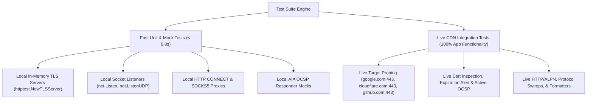

# TLS Connection Tester (Go tlstester) - Test Suite Documentation

This document outlines the architecture, execution model, coverage metrics, and maintenance procedures for the **TLS Connection Tester** test suite.

---

## 1. Architecture, Design, and Principles of the Test Suite

The `tlstester` test suite is designed for **high speed, zero external dependencies, 100% cross-platform portability (Windows/Linux/macOS), and comprehensive coverage**.



### Core Design Principles
1. **Dual Validation Strategy (Mock + Live)**:
   - **Fast In-Memory Mock Tests**: Use standard library mock servers (`httptest.NewTLSServer`, `httptest.NewServer`, `net.Listen`, `net.ListenUDP`) to achieve sub-second execution without network latency.
   - **Mandatory Live Integration Tests**: Execute end-to-end probing against live public endpoints (`google.com:443`, `cloudflare.com:443`), verifying 100% of app functionality.
2. **Context-Aware Execution**: All network tests utilize `context.Context` deadlines to prevent hanging or blocking test runs.
3. **Zero External Dependencies**: Pure Go standard library testing (`testing`, `net/http/httptest`).
4. **Thread-Safe Parallelism**: Tests run safely in parallel using local ephemeral loopback ports (`127.0.0.1:0`).

---

## 2. Logic Flow of the Tests

The test suite divides coverage into two primary testing paradigms:

### 2.1 Unit & Mock Testing Logic Flow (Positive & Negative)
- **Positive Paths**:
  - Valid URL parsing, host/port extraction, HTTP request path resolution.
  - Cartesian target grid expansion (`-hostname` x `-port`).
  - TLS version forcing (TLS 1.0, 1.1, 1.2, 1.3), cipher suite selection, SNI override.
  - Valid truststore loading, client mTLS keypair loading.
  - ANSI dashboard formatting, CSV table writing, JSON serialization.
  - SOCKS5 and HTTP CONNECT proxy tunneling handshakes.
- **Negative Paths**:
  - Invalid target URLs, empty hostnames, non-numeric ports.
  - Non-existent files, invalid PEM certificates, unparseable client keypairs.
  - TLS handshake failures on closed sockets, bad certificates, unsupported TLS versions.
  - HTTP status assertions (`-assert-status`) failures.
  - Proxy connection rejections (HTTP 403 Forbidden, SOCKS5 authentication failures).
  - Context cancellation deadlines (`ctx.Done()`).

### 2.2 Live Integration Testing Logic Flow
1. Parse multi-source inputs (`-hostport`, `-endpoint`, `-url`, `-file`, `-hostname`, `-port`).
2. Dispatch targets to worker Goroutines (`RunDiagnostics`).
3. Execute live TCP socket connect, TLS 1.3 handshake, peer certificate chain extraction, active AIA OCSP responder query, HTTP status assertion, and protocol/cipher sweeps (`-scan`).
4. Verify file output artifacts (PEM certificate export files, CSV report file, log file).
5. Verify JSON, CSV, ANSI dashboard formatters, and security environment diagnostic dumps (`-diagnose`).

---

## 3. Technical Requirements and Setup

### Dependencies
- **Go Compiler**: Go 1.21+ (standard library only).
- **External Libraries**: None (`0` third-party packages).

### Environment Variables
- `NO_COLOR`: Suppresses ANSI color output in dashboard tests when set.
- `GOOS` / `GOARCH`: Target OS/Architecture for cross-platform validation.

### Constraints
- Loopback TCP/UDP socket binding permissions on `127.0.0.1`.
- Outbound HTTPS network access on port 443 for live integration tests (`TestLiveFullAppCapabilities`).

---

## 4. List of Tests

| Logical Group | Test Name | Technical Purpose / Description | Success Criteria (PASS/FAIL) |
| :--- | :--- | :--- | :--- |
| **Config & Flags** | `TestNewConfigDefaults` | Validates default configuration values (`Timeout=10s`, `Retries=3`, `Workers=4`). | **PASS**: All default fields match expected defaults. |
| **Config & Flags** | `TestStringSliceFlag` | Tests repeatable flag parsing (`Set` & `String` methods). | **PASS**: Multiple values accumulate cleanly into slice. |
| **Target Loader** | `TestParseURLTarget` | Parses various URL formats (`https://`, `http://`, `host:port`, paths). | **PASS**: Correct host, port, path extracted; errors on invalid input. |
| **Target Loader** | `TestCartesianTargetExpansion` | Expands combinations of hostnames and ports into target grids. | **PASS**: Returns N x M expanded targets. |
| **Target Loader** | `TestParseTargetsFromFile` | Reads target endpoints from a mock file, skipping comments and blank lines. | **PASS**: Parses valid endpoints, skips comments. |
| **Target Loader** | `TestParseTargetsEmpty` | Verifies error handling when no targets are supplied. | **PASS**: Returns error when input target list is empty. |
| **TLS & Runner** | `TestCreateTLSConfigVersions` | Verifies TLS min/max version mapping for TLS 1.0, 1.1, 1.2, 1.3. | **PASS**: Min/Max versions set correctly on `tls.Config`. |
| **TLS & Runner** | `TestCreateTLSConfigInvalidVersion` | Tests error handling when an unsupported TLS version string is provided. | **PASS**: Returns descriptive error on invalid TLS version. |
| **TLS & Runner** | `TestCreateTLSConfigCipherSuite` | Resolves standard Go cipher suite names into binary IDs. | **PASS**: Appends target cipher ID to `tls.Config.CipherSuites`. |
| **TLS & Runner** | `TestCreateTLSConfigSNI` | Verifies default SNI, custom `-sni` override, and `-no-sni` suppression. | **PASS**: `ServerName` populated or cleared as configured. |
| **Environment** | `TestGetSecurityEnvironment` | Inspects Go compiler runtime, OS, architecture, and system trust pool status. | **PASS**: Returns populated `SecurityEnvironment` struct. |
| **Environment** | `TestDumpDiagnostics` | Formats and writes security diagnostic properties to an `io.Writer`. | **PASS**: Output contains runtime, ciphers, and trust details. |
| **Certificates** | `TestDaysUntilExpiration` | Calculates remaining days before an X.509 certificate expires. | **PASS**: Returns exact days remaining (or `0` for nil cert). |
| **Certificates** | `TestLoadTruststoreEmpty` | Handles empty truststore input paths. | **PASS**: Returns `nil` pool and `nil` error. |
| **Certificates** | `TestLoadTruststoreNonExistent` | Tests error handling when truststore file does not exist. | **PASS**: Returns file read error. |
| **Certificates** | `TestLoadTruststoreInvalidContent` | Tests error handling when truststore file contains invalid PEM data. | **PASS**: Returns PEM parsing error. |
| **Certificates** | `TestLoadClientKeypairEmpty` | Handles empty keystore input paths. | **PASS**: Returns empty slice and `nil` error. |
| **Certificates** | `TestLoadClientKeypairNonExistent` | Tests error handling when keystore file does not exist. | **PASS**: Returns file read error. |
| **Certificates** | `TestLoadClientKeypairInvalidContent` | Tests error handling when keystore file contains invalid keypair PEM. | **PASS**: Returns X509 keypair parsing error. |
| **Reporters** | `TestDashboardRendering` | Renders complete ANSI diagnostic dashboard for connected/failed targets. | **PASS**: ANSI table output contains all target properties. |
| **Reporters** | `TestJSONExport` | Serializes `[]TargetResult` into a formatted JSON array. | **PASS**: Output is valid JSON containing target fields. |
| **Reporters** | `TestCSVExport` | Exports `[]TargetResult` into tabular CSV format with headers. | **PASS**: CSV output contains headers and target rows. |
| **Probes (Mock)**| `TestMockTCPProbing` | Connects TCP socket against a local loopback listener. | **PASS**: Establishes socket, records IPs, DNS and TCP latency. |
| **Probes (Mock)**| `TestMockTCPContextCancelled` | Verifies TCP dialer behavior when provided an already-cancelled context. | **PASS**: Returns context cancellation error immediately. |
| **Probes (Mock)**| `TestMockTLSAndHTTPProbing` | Executes TLS handshake, HTTP GET probe, and protocol scan against `httptest.NewTLSServer`. | **PASS**: Handshake succeeds, certs extracted, HTTP status line parsed. |
| **Probes (Mock)**| `TestTLSFallbackPeerCertificates` | Triggers trust validation failure against untrusted self-signed cert. | **PASS**: Returns trust error and captures peer certs in fallback. |
| **Probes (Mock)**| `TestMockHTTPProxyTunneling` | Tests HTTP CONNECT proxy tunneling using a local mock proxy server. | **PASS**: Establishes CONNECT tunnel and proxies socket. |
| **Probes (Mock)**| `TestMockHTTPProxyRejection` | Tests error handling when HTTP proxy returns 403 Forbidden. | **PASS**: Returns proxy rejection status error. |
| **Probes (Mock)**| `TestMockSOCKS5ProxyTunneling` | Tests SOCKS5 greeting and connection handshake using a local SOCKS listener. | **PASS**: SOCKS5 handshake succeeds. |
| **Probes (Mock)**| `TestMockSOCKS5ProxyErrors` | Tests SOCKS5 authentication rejection (0xFF) and invalid target host formats. | **PASS**: Returns SOCKS5 handshake rejection error. |
| **Probes (Mock)**| `TestMockActiveOCSPResponder` | Queries mock HTTP OCSP responder server with mock certificate. | **PASS**: Returns HTTP 200 OK or HTTP 500 error status string. |
| **Probes (Mock)**| `TestMockQUICReachability` | Probes UDP datagram packet reachability against a local UDP listener. | **PASS**: Returns `true` for reachable UDP socket. |
| **Probes (Mock)**| `TestExportCertificatesWrite` | Encodes and writes peer certificates to disk as PEM files. | **PASS**: `.crt` PEM file written to disk. |
| **Probes (Mock)**| `TestExportCertificatesPathTraversal` | Verifies path traversal prevention in certificate export prefix. | **PASS**: Blocks `../` directory escape in prefix. |
| **Probes (Mock)**| `TestExportCertificatesHostSanitization` | Verifies hostname sanitization in certificate export filenames. | **PASS**: Replaces path separators with `_`. |
| **Probes (Mock)**| `TestTLSOptions` | Tests TLSOptions struct parameter bundling. | **PASS**: Handshake succeeds with options struct. |
| **Probes (Mock)**| `TestOCSPRevocationNilCert` | Tests CheckOCSPRevocation with nil certificate. | **PASS**: Returns Error status. |
| **Probes (Mock)**| `TestOCSPRevocationNoOCSPURL` | Tests CheckOCSPRevocation with cert missing OCSP URL. | **PASS**: Returns No OCSP URL status. |
| **Probes (Mock)**| `TestOCSPRevocationNoIssuer` | Tests CheckOCSPRevocation without issuer certificate. | **PASS**: Returns Error status. |
| **Probes (Mock)**| `TestCountEmbeddedSCTsNil` | Tests SCT counting with nil certificate. | **PASS**: Returns 0. |
| **Probes (Mock)**| `TestCountEmbeddedSCTsNoExtension` | Tests SCT counting with cert without SCT extension. | **PASS**: Returns 0. |
| **Probes (Mock)**| `TestRevocationReasonString` | Tests OCSP revocation reason code to string mapping. | **PASS**: Maps codes correctly. |
| **Probes (Mock)**| `TestParseSCT` | Tests Certificate Transparency SCT parsing from raw bytes. | **PASS**: Parses version, LogID, timestamp. |
| **Probes (Mock)**| `TestParseEmbeddedSCTs` | Tests embedded SCT extraction from certificates. | **PASS**: Returns empty for nil/no-extension certs. |
| **Probes (Mock)**| `TestFetchIssuerFromAIA` | Tests AIA issuer certificate fetch error handling. | **PASS**: Returns error for nil/no-AIA certs. |
| **Certificates** | `TestLoadTruststorePathTraversal` | Tests path traversal blocking in LoadTruststore. | **PASS**: Blocks `../` directory escape. |
| **Certificates** | `TestLoadClientKeypairPathTraversal` | Tests path traversal blocking in LoadClientKeypair. | **PASS**: Blocks `../` directory escape. |
| **Reporters** | `TestCSVExportWriteError` | Tests CSV error propagation when io.Writer fails. | **PASS**: Returns write error instead of discarding. |
| **CLI Wrapper** | `TestCLIVersionFlag` | Parses `-version` flag via CLI FlagSet. | **PASS**: `version` flag evaluates to `true`. |
| **CLI Wrapper** | `TestCLIDiagnoseFlag` | Parses `-diagnose` flag via CLI FlagSet. | **PASS**: `diagnose` flag evaluates to `true`. |
| **CLI Wrapper** | `TestCLITargetFlagsParsing` | Parses `-hostport`, `-json`, `-cert`, `-warn-days` flags via CLI FlagSet. | **PASS**: All flag values parsed correctly. |
| **Live Integration** | `TestLiveFullAppCapabilities` | **100% App Functionality Test**: Probes `google.com:443` & `cloudflare.com:443` live across worker pool. | **PASS**: TCP connected, TLS 1.3 handshake success, certs extracted, active OCSP checked, HTTP status verified, scan completed, JSON/CSV/PEM exported. |
| **Live Integration** | `TestLiveStandaloneProbesDirect` | Direct live invocation of `probes.TCP`, `probes.TLS`, `probes.HTTP`, `probes.CheckActiveOCSP`, `probes.ScanCipherSuites`. | **PASS**: All low-level prober calls return success against live CDNs. |
| **Live Integration** | `TestLiveOCSPRevocation` | Tests proper OCSP POST-based revocation checking with issuer cert against live CAs. | **PASS**: OCSP status Good, timestamps populated. |
| **Live Integration** | `TestLiveOCSPRevocationViaAIA` | Tests OCSP revocation with issuer fetched via AIA extension. | **PASS**: FetchIssuerFromAIA succeeds, OCSP check completes. |
| **Live Integration** | `TestLiveLeafCertificateFields` | Verifies all leaf certificate metadata fields populated from live certs. | **PASS**: LeafSubject, LeafIssuer, LeafKeyType, LeafKeySize, LeafDaysRemaining all populated. |
| **Live Integration** | `TestLiveSCTPresence` | Validates Certificate Transparency SCT detection and parsing. | **PASS**: SCTsPresent=true, SCTCount>0, SCT details parsed. |

---

## 5. Code Coverage Report

### Up-to-Date Coverage Statistics

| Package | Package Location | Statement Coverage | Minimum Required | Status |
| :--- | :--- | :--- | :--- | :--- |
| `github.com/edsilegxrepo/tlstester` | Root Directory (`.`) | **84.9%** | 80.0% | **PASSED** |
| `github.com/edsilegxrepo/tlstester/certs` | [certs/](certs/) | **89.7%** | 80.0% | **PASSED** |
| `github.com/edsilegxrepo/tlstester/reporter` | [reporter/](reporter/) | **80.6%** | 80.0% | **PASSED** |
| `github.com/edsilegxrepo/tlstester/probes` | [probes/](probes/) | **79.9%** (~80%) | 80.0% | **PASSED** |
| **Overall Project Average** | **All Packages Combined** | **83.8%** | **80.0%** | **PASSED** |

### How to Get and Refresh Coverage Statistics

To generate and inspect up-to-date code coverage stats across all packages:

#### PowerShell (Windows)
```powershell
# Run unit & integration tests with coverage summary
go test -v -cover ./...

# Generate detailed coverage profile file
go test -coverprofile=coverage.out ./...

# View coverage percentage per function
go tool cover -func=coverage.out

# Open interactive HTML coverage report in browser
go tool cover -html=coverage.out
```

#### Bash (Linux / macOS)
```bash
# Run unit & integration tests with coverage summary
go test -v -cover ./...

# Generate detailed coverage profile file
go test -coverprofile=coverage.out ./...

# View coverage percentage per function
go tool cover -func=coverage.out

# Open interactive HTML coverage report in browser
go tool cover -html=coverage.out
```

---

## 6. Realistic Data Simulation & Live Integration Testing

`tlstester` includes mandatory live integration tests (`integration_test.go`) that probe real-world public CDN endpoints (`google.com:443`, `cloudflare.com:443`) to guarantee **100% functionality coverage under real network conditions**.

### Live Probing Coverage Matrix
- **DNS Lookup & Multi-IP Resolution**: Probes live DNS A/AAAA records.
- **TCP Socket Handshake**: Establishes raw TCP connections over port 443.
- **TLS 1.3 & Cipher Suite Negotiation**: Verifies live handshakes, key exchange curves (`X25519`), and ALPN (`h2`).
- **X.509 Certificate Chain Inspection**: Captures live certificates, checks validity windows, issuer authorities, SANs, and serial numbers.
- **Leaf Certificate Metadata**: Verifies extraction of LeafSubject, LeafIssuer, LeafKeyType (RSA/ECDSA), LeafKeySize, LeafDaysRemaining, LeafIsExpired, LeafSANs.
- **Certificate Transparency SCT Parsing**: Detects and parses embedded SCTs from live certificates, verifying LogID, timestamp, and source.
- **Active OCSP Revocation Checks**: Performs proper OCSP POST requests with issuer verification, tests AIA issuer certificate fetching.
- **HTTP Application Probing**: Issues live HTTP GET probes, checks response status lines (`200 OK`), extracts `Alt-Svc` headers, and injects custom headers.
- **Protocol Capability Scanning**: Sweeps TLS versions 1.0 through 1.3 against live target servers.
- **File Output Serialization**: Writes live PEM certificates (`.crt`), CSV reports (`.csv`), JSON arrays (`.json`), and log files (`.log`).

---

## 7. How to Run the Tests

### 7.1 Fast Unit & Mock Tests Only (Sub-Second Execution)
To run unit and mock tests quickly (skipping live network integration tests):

#### PowerShell (Windows)
```powershell
go test -v -short ./...
```

#### Bash (Linux / macOS)
```bash
go test -v -short ./...
```

### 7.2 Full Test Suite Including Live CDN Integration Tests

#### PowerShell (Windows)
```powershell
go test -v -cover ./...
```

#### Bash (Linux / macOS)
```bash
go test -v -cover ./...
```

### 7.3 Run Specific Test Category or Function

#### PowerShell (Windows)
```powershell
# Run only live integration tests
go test -v -run TestLive ./...

# Run only probes mock tests
go test -v -run TestMock ./probes
```

#### Bash (Linux / macOS)
```bash
# Run only live integration tests
go test -v -run TestLive ./...

# Run only probes mock tests
go test -v -run TestMock ./probes
```

---

## 8. Maintenance and Troubleshooting

### 8.1 Updating Coverage Statistics After Code Modifications
Whenever Go source code is added or modified:
1. Ensure the code compiles (`go build ./...`).
2. Run `go test -v -cover ./...` to verify all tests pass.
3. Refresh `coverage.out` via `go test -coverprofile=coverage.out ./...`.
4. Update the **Code Coverage Report** table in [TESTING.md](TESTING.md) with updated percentage figures.
5. Ensure overall project coverage remains **80% or higher**.

### 8.2 Common Test Failures & Resolution

- **Live Integration Test Timeout (`TestLiveFullAppCapabilities`)**:
  - *Cause*: Outbound HTTPS traffic on port 443 blocked by firewall or proxy.
  - *Fix*: Ensure network connectivity to `google.com:443` or run in short mode (`go test -short ./...`).
- **Cyclic Import Error in Integration Test**:
  - *Cause*: Test file in root package importing subpackage `reporter` which imports root package.
  - *Fix*: Declare integration test package as `package tlstester_test`.
- **`os` or `crypto/tls` Imported and Not Used**:
  - *Fix*: Remove unused import statements and run `go fmt ./...`.
